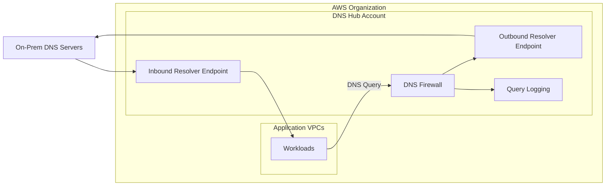

# Architecture Review: Enterprise Hybrid DNS Hub

## 1. Executive Summary
This design implements a production-grade, organization-wide DNS architecture using **Amazon Route 53 Resolver**. By centralizing inbound and outbound DNS traffic within a dedicated **Shared Services (DNS Hub) Account**, we eliminate configuration drift, reduce costs, and provide a single point of inspection for security and logging.

### Key Objectives
* **Zero Trust DNS:** Centralized DNS Firewall to block data exfiltration and malware.
* **Operational Efficiency:** Use AWS RAM to share resolver rules across hundreds of accounts.
* **Hybrid Connectivity:** Seamless resolution between AWS Private Hosted Zones and On-Premises environments.

---

## 2. High-Level Architecture
The architecture utilizes a "DNS Hub" VPC. All "Spoke" VPCs (Application Accounts) associate with the shared resolver rules, directing on-premises queries to the Hub's outbound endpoints via Transit Gateway or Direct Connect.



---

## 3. Core Component Deep-Dive (Terraform)

### 3.1 Resolver Endpoints (The Network Bridge)
The foundation of the architecture involves creating ENIs in the Hub VPC. We separate **Inbound** (On-prem to AWS) and **Outbound** (AWS to On-prem) to allow for granular Security Group control.

```hcl
resource "aws_security_group" "dns_hub_sg" {
  name   = "dns-hub-resolver-sg"
  vpc_id = var.vpc_id

  ingress {
    from_port   = 53
    to_port     = 53
    protocol    = "udp"
    cidr_blocks = var.allowed_cidrs # On-prem & Internal Ranges
  }

  ingress {
    from_port   = 53
    to_port     = 53
    protocol    = "tcp"
    cidr_blocks = var.allowed_cidrs
  }

  egress {
    from_port   = 0
    to_port     = 0
    protocol    = "-1"
    cidr_blocks = ["0.0.0.0/0"]
  }
}

resource "aws_route53_resolver_endpoint" "inbound" {
  name               = "hub-inbound-endpoint"
  direction          = "INBOUND"
  security_group_ids = [aws_security_group.dns_hub_sg.id]

  dynamic "ip_address" {
    for_each = var.subnet_ids
    content { subnet_id = ip_address.value }
  }
}

resource "aws_route53_resolver_endpoint" "outbound" {
  name               = "hub-outbound-endpoint"
  direction          = "OUTBOUND"
  security_group_ids = [aws_security_group.dns_hub_sg.id]

  dynamic "ip_address" {
    for_each = var.subnet_ids
    content { subnet_id = ip_address.value }
  }
}
```

### 3.2 Resolver Rules & Organization-Wide Sharing
To prevent every account from needing its own endpoints, we define rules in the Hub and share them via **AWS Resource Access Manager (RAM)**.

```hcl
# 1. Define the Forwarding Rule
resource "aws_route53_resolver_rule" "onprem_forwarder" {
  domain_name          = "corp.example.com"
  rule_type            = "FORWARD"
  resolver_endpoint_id = aws_route53_resolver_endpoint.outbound.id

  dynamic "target_ip" {
    for_each = var.onprem_dns_ips
    content {
      ip   = target_ip.value
      port = 53
    }
  }
}

# 2. Share via RAM to the entire Organization
resource "aws_ram_resource_share" "dns_rules" {
  name                      = "shared-dns-rules"
  allow_external_principals = false
}

resource "aws_ram_resource_association" "rule_assoc" {
  resource_share_arn = aws_ram_resource_share.dns_rules.arn
  resource_arn       = aws_route53_resolver_rule.onprem_forwarder.arn
}

resource "aws_ram_principal_association" "org_assoc" {
  principal          = var.organization_arn
  resource_share_arn = aws_ram_resource_share.dns_rules.arn
}
```

### 3.3 DNS Firewall & Observability
Centralized security allows us to block DNS tunneling and communication with known command-and-control (C2) servers.

```hcl
resource "aws_route53_resolver_firewall_rule_group" "main" {
  name = "global-dns-firewall"
}

resource "aws_route53_resolver_firewall_rule" "block_malicious" {
  name                    = "block-known-malicious"
  firewall_rule_group_id  = aws_route53_resolver_firewall_rule_group.main.id
  firewall_domain_list_id = var.malicious_domain_list_id
  priority                = 100
  action                  = "BLOCK"
}

resource "aws_route53_resolver_query_log_config" "hub_logs" {
  name            = "central-dns-logs"
  destination_arn = aws_cloudwatch_log_group.resolver_logs.arn
}
```

---

## 4. Resolution Logic & Traffic Flow

### AWS → On-Premises Flow
1.  **VPC Resolver:** A workload queries `app.corp.example.com`.
2.  **Rule Match:** The VPC checks its associated rules (shared from the Hub). It finds a match for `corp.example.com`.
3.  **Outbound Transit:** The query is sent to the **Outbound Resolver Endpoint** in the Hub Account.
4.  **Network Path:** The Hub Account routes the packet over Direct Connect/VPN to the on-prem DNS servers.

### On-Premises → AWS Flow
1.  **Conditional Forwarder:** On-prem DNS servers (AD/BIND) are configured to forward `*.aws.internal` to the **Inbound Resolver Endpoint** IPs.
2.  **AWS Resolution:** The Inbound Endpoint receives the query and resolves it against the **Private Hosted Zones** associated with the Hub VPC.

---

## 5. Critical Engineering Considerations

### 5.1 Preventing DNS Loops
> [!WARNING]
> **Recursive Loops:** Never point an Inbound Endpoint to an Outbound Endpoint, or create a rule that forwards a domain back to the Inbound Endpoint. This causes infinite recursion, leading to endpoint exhaustion and high costs.

### 5.2 Capacity Planning
* **IP Allocation:** Allocate at least 2 IPs (one per AZ) for each endpoint. For high-volume environments, use 3 or 4 AZs.
* **Throttle Limits:** Each IP address in an endpoint supports up to 10,000 queries per second (QPS). Monitor `InboundQueryVolume` and `OutboundQueryVolume` in CloudWatch.

### 5.3 Availability Tiering
Treat the DNS Hub as **Tier-0 Infrastructure**.
* **Health Checks:** Configure Route 53 health checks on the on-premises target IPs.
* **No NAT:** Endpoints do not require a NAT Gateway; they live inside your private subnets but require connectivity to the Route 53 service (via interface endpoints or IGW/VPC PrivateLink).

---

## 6. Operational Checklist
* [ ] **CI/CD Only:** All DNS rules and firewall changes must be peer-reviewed in Terraform.
* [ ] **Monitoring:** Set alarms for `NXDOMAIN` spikes, which may indicate a misconfiguration or a security event.
* [ ] **Audit:** Periodically review RAM associations to ensure only authorized accounts have access to internal resolution paths.
* [ ] **Managed Lists:** Use AWS-managed domain lists to stay updated on emerging threats without manual list maintenance.
